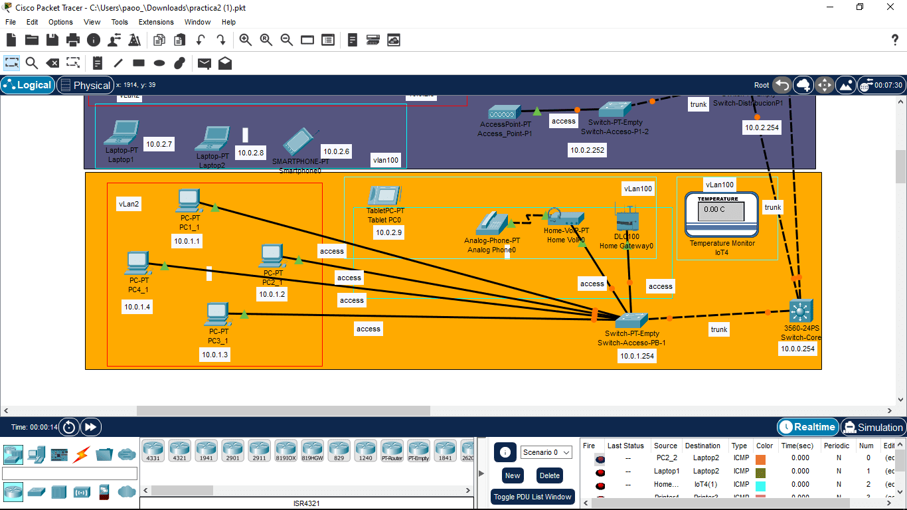
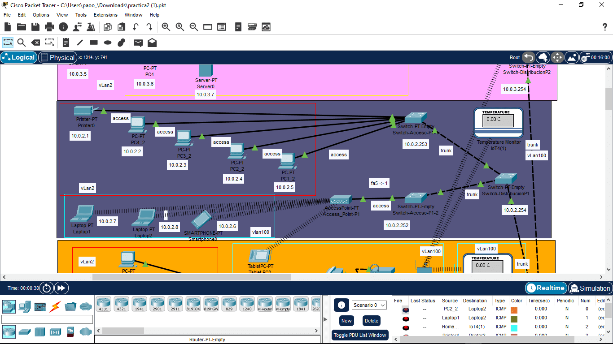
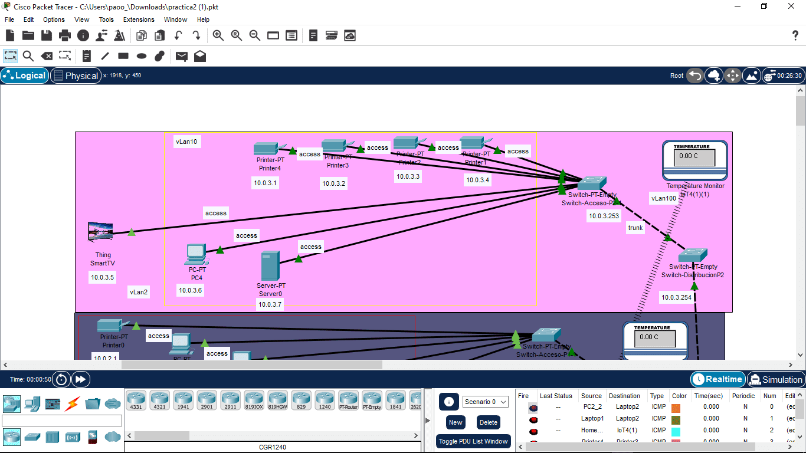

# Práctica 2 - Configuración de VLAN en switches administrables

### Equipo:

* FRAF-GSLP-HHR-VAJ-VCIY

### Integrantes

* Fernández Romero Adrián Felipe - 316093404 - AdrianFernandezR

* Gallegos Salgado Leslie Paola - 314089830 - paolagallegos

* Hérnandez Hérnandez Raúl - 308180994 - ruloCiencias

* Vázquez Alvarez Julio - 314334398 - JulsVazquez

* Velázquez Caballero Ixchel Yanira - 313119895 - Ixveca

## Explicación de la topología de red utilizada.

### Tabla vLAN
|        Equipo       |   vLAN   |
|---------------------|----------|
|Nivel 1                   			 |
|PC1_1                |vLan2     |
|PC2_1                |vLan2     |
|PC3_1                |vLan2     |
|PC4_1                |vLan2     |
|Tablet PC0           |vLan100   |
|Analog Phone0        |vLan100   |
|Home VolP0           |vLan100   |
|Home Gateway         |vLan100   |
|Nivel 2               			     |
|Printer0             |vLan2     |
|PC4_2                |vLan2     |
|PC3_2                |vLan2     |
|PC2_2                |vLan2     |
|PC1_2                |vLan2     |
|Smartphone0          |vLan100   |
|Laptop1              |vLan100   |
|Laptop2              |vLan100   |
|Nivel 3                  		   |
|SmartTV              |vLan2     |
|Printer4             |vLan11    |
|Printer3             |vLan11    |
|Printer2             |vLan11    |
|Printer1             |vLan11    |
|PC4                  |vLan11    |
|Server0              |vLan11    |

### Tabla de conexión Switch
|    DeviceID   |Local Intrfce|Holdtme|Capability|Platform|Port ID|
|---------------|-------------|-------|----------|--------|-------|
|Nivel 1                 			   |
|Switch-Core:					|
| DistP1        |Fas 0/2|134|S|PT3000|Fas 0/1|
| DistP2        |Fas 0/3|134|S|PT3000|Fas 0/1|
| Pb01          |Fas 0/1|134|S|PT3000|Fas 0/1|
|Switch-Acceso-PB-1:  |
| Switch        |Fas 0/1|157|-|3560|Fas 0/1|
|Nivel 2                    		 |
|Switch-Acceso-P1-1:  |
| DistP1          |Fas 0/1|133|S|PT3000|Fas 2/1|
|Switch-Acceso-P1-2:  |
| DistP1          |Fas 0/1|121|S|PT3000|Fas 2/1|
|Switch-DistribucionP1:  |
| AccesP1-1       |Fas 1/1|161|S|PT3000|Fas 0/1|
| Switch          |Fas 0/1|164|-|3560  |Fas 0/2|
| AccesP1-2       |Fas 2/1|164|S|PT3000|Fas 0/1|
|Nivel 3                    		 |
|Switch-Acceso-P2-1:   |
| DistP2          |Fas 0/1|137|S|PT3000|Fas 1/1|
|Switch-DistribucionP2:|
| Switch          |Fas 0/1|130|-|3560  |Fas 0/3|
| AccesP2-1       |Fas 1/1|128|S|PT3000|Fas 0/1|

### Tabla IP

|        Equipo       |
|---------------------|
|Nivel 1              |
|Switch-Core	        |

```console
Switch#show ip interface brief

Interface IP-Address OK? Method Status Protocol

FastEthernet0/1 unassigned YES unset up up

FastEthernet0/2 unassigned YES unset up up

FastEthernet0/3 unassigned YES unset up up

FastEthernet0/4 unassigned YES unset down down

FastEthernet0/5 unassigned YES unset down down

FastEthernet0/6 unassigned YES unset down down

FastEthernet0/7 unassigned YES unset down down

FastEthernet0/8 unassigned YES unset down down

FastEthernet0/9 unassigned YES unset down down

FastEthernet0/10 unassigned YES unset down down

FastEthernet0/11 unassigned YES unset down down

FastEthernet0/12 unassigned YES unset down down

FastEthernet0/13 unassigned YES unset down down

FastEthernet0/14 unassigned YES unset down down

FastEthernet0/15 unassigned YES unset down down

FastEthernet0/16 unassigned YES unset down down

FastEthernet0/17 unassigned YES unset down down

FastEthernet0/18 unassigned YES unset down down

FastEthernet0/19 unassigned YES unset down down

FastEthernet0/20 unassigned YES unset down down

FastEthernet0/21 unassigned YES unset down down

FastEthernet0/22 unassigned YES unset down down

FastEthernet0/23 unassigned YES unset down down

FastEthernet0/24 unassigned YES unset down down

GigabitEthernet0/1 unassigned YES unset down down

GigabitEthernet0/2 unassigned YES unset down down

Vlan1 unassigned YES unset administratively down down

Vlan2 10.2.0.3 YES manual up up

Vlan10 10.10.0.3 YES manual up up

Vlan11 10.11.0.3 YES manual up up

Vlan100 10.100.0.3 YES manual up up
```
|        Equipo       |
|---------------------|
|Switch-Acceso-PB-1   |

```console
Pb01#show ip interface brief

Interface IP-Address OK? Method Status Protocol

FastEthernet0/1 unassigned YES manual up up

FastEthernet1/1 unassigned YES manual up up

FastEthernet2/1 unassigned YES manual up up

FastEthernet3/1 unassigned YES manual up up

FastEthernet4/1 unassigned YES manual up up

FastEthernet5/1 unassigned YES manual up up

FastEthernet6/1 unassigned YES manual up up

FastEthernet7/1 unassigned YES manual down down

FastEthernet8/1 unassigned YES manual down down

FastEthernet9/1 unassigned YES manual down down

Vlan1 192.168.1.10 YES manual up up

Vlan2 10.2.0.6 YES manual up up

Vlan10 10.10.0.6 YES manual up up

Vlan100 10.100.0.6 YES manual up up
```
|        Equipo       |
|---------------------|
|Nivel 2              |
|Switch-Acceso-P1-1   |

```console
AccesP1-1#show ip interface brief

Interface IP-Address OK? Method Status Protocol

FastEthernet0/1 unassigned YES manual up up

FastEthernet1/1 unassigned YES manual up up

FastEthernet2/1 unassigned YES manual up up

FastEthernet3/1 unassigned YES manual up up

FastEthernet4/1 unassigned YES manual up up

FastEthernet5/1 unassigned YES manual up up

FastEthernet6/1 unassigned YES manual down down

FastEthernet7/1 unassigned YES manual down down

FastEthernet8/1 unassigned YES manual down down

FastEthernet9/1 unassigned YES manual down down

Vlan1 unassigned YES manual administratively down down

Vlan2 10.2.0.4 YES manual up up

Vlan10 10.10.0.4 YES manual up up

Vlan100 unassigned YES manual up up
```
|        Equipo       |
|---------------------|
|Switch-Acceso-P1-2   |

```console
AccesP1-2#show ip interface brief

Interface IP-Address OK? Method Status Protocol

FastEthernet0/1 unassigned YES manual up up

FastEthernet1/1 unassigned YES manual down down

FastEthernet2/1 unassigned YES manual down down

FastEthernet3/1 unassigned YES manual down down

FastEthernet4/1 unassigned YES manual down down

FastEthernet5/1 unassigned YES manual up up

FastEthernet6/1 unassigned YES manual down down

FastEthernet7/1 unassigned YES manual down down

FastEthernet8/1 unassigned YES manual down down

FastEthernet9/1 unassigned YES manual down down

Vlan1 unassigned YES manual administratively down down

Vlan2 10.2.0.4 YES manual up up

Vlan10 10.10.0.4 YES manual up up

Vlan100 10.100.0.4 YES manual up up
```
|        Equipo       |
|---------------------|
|Switch-DistribucionP1|
```console
DistP1#show ip interface brief

Interface IP-Address OK? Method Status Protocol

FastEthernet0/1 unassigned YES manual up up

FastEthernet1/1 unassigned YES manual up up

FastEthernet2/1 unassigned YES manual up up

FastEthernet3/1 unassigned YES manual down down

FastEthernet4/1 unassigned YES manual down down

FastEthernet5/1 unassigned YES manual down down

FastEthernet6/1 unassigned YES manual down down

FastEthernet7/1 unassigned YES manual down down

FastEthernet8/1 unassigned YES manual down down

FastEthernet9/1 unassigned YES manual down down

Vlan1 unassigned YES manual administratively down down

Vlan2 10.2.0.4 YES manual up up

Vlan10 10.10.0.4 YES manual up up

Vlan100 10.100.0.4 YES manual up up
```
|        Equipo       |
|---------------------|
|Nivel 3              |
|Switch-Acceso-P2-1   |
```console
AccesP2-1#show ip interface brief

Interface IP-Address OK? Method Status Protocol

FastEthernet0/1 unassigned YES manual up up

FastEthernet1/1 unassigned YES manual up up

FastEthernet2/1 unassigned YES manual up up

FastEthernet3/1 unassigned YES manual up up

FastEthernet4/1 unassigned YES manual up up

FastEthernet5/1 unassigned YES manual up up

FastEthernet6/1 unassigned YES manual up up

FastEthernet7/1 unassigned YES manual up up

FastEthernet8/1 unassigned YES manual down down

FastEthernet9/1 unassigned YES manual down down

Vlan1 unassigned YES manual administratively down down

Vlan2 10.2.0.2 YES manual up up

Vlan10 10.10.0.2 YES manual up up

Vlan100 10.100.0.2 YES manual up up
```
|        Equipo       |
|---------------------|
|Switch-DistribucionP2|
```console
DistP2#show ip interface brief

Interface IP-Address OK? Method Status Protocol

FastEthernet0/1 unassigned YES manual up up

FastEthernet1/1 unassigned YES manual up up

FastEthernet2/1 unassigned YES manual down down

FastEthernet3/1 unassigned YES manual down down

FastEthernet4/1 unassigned YES manual down down

FastEthernet5/1 unassigned YES manual down down

FastEthernet6/1 unassigned YES manual down down

FastEthernet7/1 unassigned YES manual down down

FastEthernet8/1 unassigned YES manual down down

FastEthernet9/1 unassigned YES manual down down

Vlan1 unassigned YES manual administratively down down

Vlan2 10.2.0.2 YES manual up up

Vlan10 10.10.0.2 YES manual up up
```
### Tabla de ruteo switch multicapa
```console
Switch#show ip route

Codes: C - connected, S - static, I - IGRP, R - RIP, M - mobile, B - BGP

D - EIGRP, EX - EIGRP external, O - OSPF, IA - OSPF inter area

N1 - OSPF NSSA external type 1, N2 - OSPF NSSA external type 2

E1 - OSPF external type 1, E2 - OSPF external type 2, E - EGP

i - IS-IS, L1 - IS-IS level-1, L2 - IS-IS level-2, ia - IS-IS inter area

* - candidate default, U - per-user static route, o - ODR

P - periodic downloaded static route

Gateway of last resort is not set

[10.0.0.0/24](http://10.0.0.0/24) is subnetted, 4 subnets

C 10.2.0.0 is directly connected, Vlan2

C 10.10.0.0 is directly connected, Vlan10

C 10.11.0.0 is directly connected, Vlan11

C 10.100.0.0 is directly connected, Vlan100
```
### Pruebas de red
```console
Cisco Packet Tracer PC Command Line 1.0

C:\>ping 10.0.1.1

Pinging 10.0.1.1 with 32 bytes of data:

Reply from [10.0.1.1](http://10.0.1.1): bytes=32 time=12ms TTL=128

Reply from [10.0.1.1](http://10.0.1.1): bytes=32 time<1ms TTL=128

Reply from [10.0.1.1](http://10.0.1.1): bytes=32 time=21ms TTL=128

Reply from [10.0.1.1](http://10.0.1.1): bytes=32 time=7ms TTL=128

Ping statistics for [10.0.1.1](http://10.0.1.1):

Packets: Sent = 4, Received = 4, Lost = 0 (0% loss),

Approximate round trip times in milli-seconds:

Minimum = 0ms, Maximum = 21ms, Average = 10ms

C:\>ping 10.0.1.2

Pinging 10.0.1.2 with 32 bytes of data:

Reply from [10.0.1.2](http://10.0.1.2): bytes=32 time<1ms TTL=128

Reply from [10.0.1.2](http://10.0.1.2): bytes=32 time<1ms TTL=128

Reply from [10.0.1.2](http://10.0.1.2): bytes=32 time<1ms TTL=128

Reply from [10.0.1.2](http://10.0.1.2): bytes=32 time<1ms TTL=128

Ping statistics for [10.0.1.2](http://10.0.1.2):

Packets: Sent = 4, Received = 4, Lost = 0 (0% loss),

Approximate round trip times in milli-seconds:

Minimum = 0ms, Maximum = 0ms, Average = 0ms

C:\>ping 10.0.1.3

Pinging 10.0.1.3 with 32 bytes of data:

Reply from [10.0.1.3](http://10.0.1.3): bytes=32 time<1ms TTL=128

Reply from [10.0.1.3](http://10.0.1.3): bytes=32 time<1ms TTL=128

Reply from [10.0.1.3](http://10.0.1.3): bytes=32 time<1ms TTL=128

Reply from [10.0.1.3](http://10.0.1.3): bytes=32 time<1ms TTL=128

Ping statistics for [10.0.1.3](http://10.0.1.3):

Packets: Sent = 4, Received = 4, Lost = 0 (0% loss),

Approximate round trip times in milli-seconds:

Minimum = 0ms, Maximum = 0ms, Average = 0ms

C:\>ping 10.0.1.4

Pinging 10.0.1.4 with 32 bytes of data:

Reply from [10.0.1.4](http://10.0.1.4): bytes=32 time<1ms TTL=128

Reply from [10.0.1.4](http://10.0.1.4): bytes=32 time<1ms TTL=128

Reply from [10.0.1.4](http://10.0.1.4): bytes=32 time<1ms TTL=128

Reply from [10.0.1.4](http://10.0.1.4): bytes=32 time<1ms TTL=128

Ping statistics for [10.0.1.4](http://10.0.1.4):

Packets: Sent = 4, Received = 4, Lost = 0 (0% loss),

Approximate round trip times in milli-seconds:

Minimum = 0ms, Maximum = 0ms, Average = 0ms

C:\>ping 10.0.254

Ping request could not find host 10.0.254. Please check the name and try again.

C:\>ping 10.0.2.1

Pinging 10.0.2.1 with 32 bytes of data:

Reply from [10.0.2.1](http://10.0.2.1): bytes=32 time<1ms TTL=128

Reply from [10.0.2.1](http://10.0.2.1): bytes=32 time<1ms TTL=128

Reply from [10.0.2.1](http://10.0.2.1): bytes=32 time<1ms TTL=128

Reply from [10.0.2.1](http://10.0.2.1): bytes=32 time<1ms TTL=128

Ping statistics for [10.0.2.1](http://10.0.2.1):

Packets: Sent = 4, Received = 4, Lost = 0 (0% loss),

Approximate round trip times in milli-seconds:

Minimum = 0ms, Maximum = 0ms, Average = 0ms

C:\>ping 10.0.2.2

Pinging 10.0.2.2 with 32 bytes of data:

Reply from [10.0.2.2](http://10.0.2.2): bytes=32 time<1ms TTL=128

Reply from [10.0.2.2](http://10.0.2.2): bytes=32 time<1ms TTL=128

Reply from [10.0.2.2](http://10.0.2.2): bytes=32 time<1ms TTL=128

Reply from [10.0.2.2](http://10.0.2.2): bytes=32 time<1ms TTL=128

Ping statistics for [10.0.2.2](http://10.0.2.2):

Packets: Sent = 4, Received = 4, Lost = 0 (0% loss),

Approximate round trip times in milli-seconds:

Minimum = 0ms, Maximum = 0ms, Average = 0ms

C:\>ping 10.0.2.3

Pinging 10.0.2.3 with 32 bytes of data:

Reply from [10.0.2.3](http://10.0.2.3): bytes=32 time=10ms TTL=128

Reply from [10.0.2.3](http://10.0.2.3): bytes=32 time<1ms TTL=128

Reply from [10.0.2.3](http://10.0.2.3): bytes=32 time<1ms TTL=128

Reply from [10.0.2.3](http://10.0.2.3): bytes=32 time<1ms TTL=128

Ping statistics for [10.0.2.3](http://10.0.2.3):

Packets: Sent = 4, Received = 4, Lost = 0 (0% loss),

Approximate round trip times in milli-seconds:

Minimum = 0ms, Maximum = 10ms, Average = 2ms

C:\>ping 10.0.2.4

Pinging 10.0.2.4 with 32 bytes of data:

Reply from [10.0.2.4](http://10.0.2.4): bytes=32 time<1ms TTL=128

Reply from [10.0.2.4](http://10.0.2.4): bytes=32 time<1ms TTL=128

Reply from [10.0.2.4](http://10.0.2.4): bytes=32 time=1ms TTL=128

Reply from [10.0.2.4](http://10.0.2.4): bytes=32 time<1ms TTL=128

Ping statistics for [10.0.2.4](http://10.0.2.4):

Packets: Sent = 4, Received = 4, Lost = 0 (0% loss),

Approximate round trip times in milli-seconds:

Minimum = 0ms, Maximum = 1ms, Average = 0ms

C:\>ping 10.0.2.5

Pinging 10.0.2.5 with 32 bytes of data:

Reply from [10.0.2.5](http://10.0.2.5): bytes=32 time=10ms TTL=128

Reply from [10.0.2.5](http://10.0.2.5): bytes=32 time<1ms TTL=128

Reply from [10.0.2.5](http://10.0.2.5): bytes=32 time<1ms TTL=128

Reply from [10.0.2.5](http://10.0.2.5): bytes=32 time<1ms TTL=128

Ping statistics for [10.0.2.5](http://10.0.2.5):

Packets: Sent = 4, Received = 4, Lost = 0 (0% loss),

Approximate round trip times in milli-seconds:

Minimum = 0ms, Maximum = 10ms, Average = 2ms

C:\>ping 10.0.3.1

Pinging 10.0.3.1 with 32 bytes of data:

Reply from [10.0.3.1](http://10.0.3.1): bytes=32 time<1ms TTL=128

Reply from [10.0.3.1](http://10.0.3.1): bytes=32 time<1ms TTL=128

Reply from [10.0.3.1](http://10.0.3.1): bytes=32 time<1ms TTL=128

Reply from [10.0.3.1](http://10.0.3.1): bytes=32 time<1ms TTL=128

Ping statistics for [10.0.3.1](http://10.0.3.1):

Packets: Sent = 4, Received = 4, Lost = 0 (0% loss),

Approximate round trip times in milli-seconds:

Minimum = 0ms, Maximum = 0ms, Average = 0ms

C:\>ping 10.0.3.2

Pinging 10.0.3.2 with 32 bytes of data:

Reply from [10.0.3.2](http://10.0.3.2): bytes=32 time=1ms TTL=128

Reply from [10.0.3.2](http://10.0.3.2): bytes=32 time<1ms TTL=128

Reply from [10.0.3.2](http://10.0.3.2): bytes=32 time<1ms TTL=128

Reply from [10.0.3.2](http://10.0.3.2): bytes=32 time=1ms TTL=128

Ping statistics for [10.0.3.2](http://10.0.3.2):

Packets: Sent = 4, Received = 4, Lost = 0 (0% loss),

Approximate round trip times in milli-seconds:

Minimum = 0ms, Maximum = 1ms, Average = 0ms

C:\>ping 10.0.3.3

Pinging 10.0.3.3 with 32 bytes of data:

Reply from [10.0.3.3](http://10.0.3.3): bytes=32 time<1ms TTL=128

Reply from [10.0.3.3](http://10.0.3.3): bytes=32 time<1ms TTL=128

Reply from [10.0.3.3](http://10.0.3.3): bytes=32 time<1ms TTL=128

Reply from [10.0.3.3](http://10.0.3.3): bytes=32 time<1ms TTL=128

Ping statistics for [10.0.3.3](http://10.0.3.3):

Packets: Sent = 4, Received = 4, Lost = 0 (0% loss),

Approximate round trip times in milli-seconds:

Minimum = 0ms, Maximum = 0ms, Average = 0ms

C:\>ping 10.0.3.4

Pinging 10.0.3.4 with 32 bytes of data:

Reply from [10.0.3.4](http://10.0.3.4): bytes=32 time<1ms TTL=128

Reply from [10.0.3.4](http://10.0.3.4): bytes=32 time<1ms TTL=128

Reply from [10.0.3.4](http://10.0.3.4): bytes=32 time<1ms TTL=128

Reply from [10.0.3.4](http://10.0.3.4): bytes=32 time<1ms TTL=128

Ping statistics for [10.0.3.4](http://10.0.3.4):

Packets: Sent = 4, Received = 4, Lost = 0 (0% loss),

Approximate round trip times in milli-seconds:

Minimum = 0ms, Maximum = 0ms, Average = 0ms

C:\>ping 10.0.3.6

Pinging 10.0.3.6 with 32 bytes of data:

Reply from [10.0.3.6](http://10.0.3.6): bytes=32 time<1ms TTL=128

Reply from [10.0.3.6](http://10.0.3.6): bytes=32 time=2ms TTL=128

Reply from [10.0.3.6](http://10.0.3.6): bytes=32 time<1ms TTL=128

Reply from [10.0.3.6](http://10.0.3.6): bytes=32 time=5ms TTL=128

Ping statistics for [10.0.3.6](http://10.0.3.6):

Packets: Sent = 4, Received = 4, Lost = 0 (0% loss),

Approximate round trip times in milli-seconds:

Minimum = 0ms, Maximum = 5ms, Average = 1ms

C:\>ping 10.0.3.7

Pinging 10.0.3.7 with 32 bytes of data:

Reply from [10.0.3.7](http://10.0.3.7): bytes=32 time<1ms TTL=128

Reply from [10.0.3.7](http://10.0.3.7): bytes=32 time=1ms TTL=128

Reply from [10.0.3.7](http://10.0.3.7): bytes=32 time<1ms TTL=128

Reply from [10.0.3.7](http://10.0.3.7): bytes=32 time<1ms TTL=128

Ping statistics for [10.0.3.7](http://10.0.3.7):

Packets: Sent = 4, Received = 4, Lost = 0 (0% loss),

Approximate round trip times in milli-seconds:

Minimum = 0ms, Maximum = 1ms, Average = 0ms

```

### Topología

|       	       |
|:----------------------------------------------------:|
|VLAN Primer nivel del Taller Domingo García Ramos|

|       	       |
|:----------------------------------------------------:|
|VLAN Segundo nivel del Taller Domingo García Ramos|

|       	       |
|:----------------------------------------------------:|
|VLAN Tercer nivel del Taller Domingo García Ramos|
