# Práctica 3 - Configuración de routers

### Equipo:

* FRAF-GSLP-HHR-VAJ-VCIY

### Integrantes

* Fernández Romero Adrián Felipe - 316093404 - AdrianFernandezR

* Gallegos Salgado Leslie Paola - 314089830 - paolagallegos

* Hérnandez Hérnandez Raúl - 308180994 - ruloCiencias

* Vázquez Alvarez Julio - 314334398 - JulsVazquez

* Velázquez Caballero Ixchel Yanira - 313119895 - Ixveca
             
### Tabla de Equipos
|Equipo | Host   |
|-------|--------|
|Router0|Router_0|
```console
Router_0#show cdp neighbors

Capability Codes: R - Router, T - Trans Bridge, B - Source Route Bridge

S - Switch, H - Host, I - IGMP, r - Repeater, P - Phone

Device ID Local Intrfce Holdtme Capability Platform Port ID

Router_1 Gig 3/0 173 R PT1000 Gig 3/0

Switch_0 Fas 0/0 173 S PT3000 Fas 0/1

Router_0#show ip arp

Protocol Address Age (min) Hardware Addr Type Interface

Internet 172.16.0.1 - 0090.2BE8.AD01 ARPA GigabitEthernet3/0

Internet 172.16.0.2 28 0060.3E22.6003 ARPA GigabitEthernet3/0

Internet 192.168.0.1 - 00E0.B0A4.8450 ARPA FastEthernet0/0

Router_0#show ip interface brief

Interface IP-Address OK? Method Status Protocol

FastEthernet0/0 192.168.0.1 YES manual up up

FastEthernet1/0 unassigned YES unset administratively down down

FastEthernet2/0 unassigned YES unset administratively down down

GigabitEthernet3/0 172.16.0.1 YES manual up up

GigabitEthernet4/0 unassigned YES unset administratively down down

GigabitEthernet5/0 unassigned YES unset administratively down down

Router_0#show ip route

Codes: C - connected, S - static, I - IGRP, R - RIP, M - mobile, B - BGP

D - EIGRP, EX - EIGRP external, O - OSPF, IA - OSPF inter area

N1 - OSPF NSSA external type 1, N2 - OSPF NSSA external type 2

E1 - OSPF external type 1, E2 - OSPF external type 2, E - EGP

i - IS-IS, L1 - IS-IS level-1, L2 - IS-IS level-2, ia - IS-IS inter area

* - candidate default, U - per-user static route, o - ODR

P - periodic downloaded static route

Gateway of last resort is not set
 
R 10.0.0.0/8 [120/1] via 172.16.0.2, 00:00:16, GigabitEthernet3/0

R 113.0.0.0/8 [120/2] via 172.16.0.2, 00:00:16, GigabitEthernet3/0

172.16.0.0/24 is subnetted, 2 subnets

C 172.16.0.0 is directly connected, GigabitEthernet3/0

R 172.16.1.0 [120/1] via 172.16.0.2, 00:00:16, GigabitEthernet3/0

C 192.168.0.0/24 is directly connected, FastEthernet0/0
 
Router_0#show ip route summary

IP routing table name is Default-IP-Routing-Table(0)

IP routing table maximum-paths is 16

Route Source Networks Subnets Overhead Memory (bytes)

connected 1 1 144 256

static 0 0 0 0

rip 2 1 216 384

internal 1 1148

Total 4 2 360 1788
```
|Equipo | Host   |
|-------|--------|
|Router1|Router_1|
```console
Router_1#show cdp neighbors

Capability Codes: R - Router, T - Trans Bridge, B - Source Route Bridge

S - Switch, H - Host, I - IGMP, r - Repeater, P - Phone

Device ID Local Intrfce Holdtme Capability Platform Port ID

Router_2 Gig 4/0 151 R PT1000 Gig 3/0

Router_0 Gig 3/0 151 R PT1000 Gig 3/0

Switch_1 Fas 0/0 151 S PT3000 Fas 0/1

Router_1#show ip arp

Protocol Address Age (min) Hardware Addr Type Interface

Internet 10.10.10.1 - 0060.3E34.D086 ARPA FastEthernet0/0

Internet 172.16.0.1 30 0090.2BE8.AD01 ARPA GigabitEthernet3/0

Internet 172.16.0.2 - 0060.3E22.6003 ARPA GigabitEthernet3/0

Internet 172.16.1.3 - 00E0.8FD1.4A67 ARPA GigabitEthernet4/0

Internet 172.16.1.4 30 0030.F2C3.9ED5 ARPA GigabitEthernet4/0

Router_1#show ip interface brief

Interface IP-Address OK? Method Status Protocol

FastEthernet0/0 10.10.10.1 YES manual up up

FastEthernet1/0 unassigned YES unset administratively down down

FastEthernet2/0 unassigned YES unset administratively down down

GigabitEthernet3/0 172.16.0.2 YES manual up up

GigabitEthernet4/0 172.16.1.3 YES manual up up

GigabitEthernet5/0 unassigned YES unset administratively down down

Router_1#show ip route

Codes: C - connected, S - static, I - IGRP, R - RIP, M - mobile, B - BGP

D - EIGRP, EX - EIGRP external, O - OSPF, IA - OSPF inter area

N1 - OSPF NSSA external type 1, N2 - OSPF NSSA external type 2

E1 - OSPF external type 1, E2 - OSPF external type 2, E - EGP

i - IS-IS, L1 - IS-IS level-1, L2 - IS-IS level-2, ia - IS-IS inter area

* - candidate default, U - per-user static route, o - ODR

P - periodic downloaded static route

Gateway of last resort is not set

10.0.0.0/24 is subnetted, 1 subnets

C 10.10.10.0 is directly connected, FastEthernet0/0

R 113.0.0.0/8 [120/1] via 172.16.1.4, 00:00:02, GigabitEthernet4/0

172.16.0.0/24 is subnetted, 2 subnets

C 172.16.0.0 is directly connected, GigabitEthernet3/0

C 172.16.1.0 is directly connected, GigabitEthernet4/0

R 192.168.0.0/24 [120/1] via 172.16.0.1, 00:00:15, GigabitEthernet3/0

Router_1#show ip route summary

IP routing table name is Default-IP-Routing-Table(0)

IP routing table maximum-paths is 16

Route Source Networks Subnets Overhead Memory (bytes)

connected 0 3 216 384

static 0 0 0 0

rip 2 0 144 256

internal 2 2296

Total 4 3 360 2936
```
|Equipo | Host   |
|-------|--------|
|Router2|Router_2|
```console
Router_2#show cdp neighbors

Capability Codes: R - Router, T - Trans Bridge, B - Source Route Bridge

S - Switch, H - Host, I - IGMP, r - Repeater, P - Phone

Device ID Local Intrfce Holdtme Capability Platform Port ID

Router_1 Gig 3/0 137 R PT1000 Gig 4/0

Switch_2 Fas 0/0 137 S PT3000 Fas 0/1

Router_2#show ip arp

Protocol Address Age (min) Hardware Addr Type Interface

Internet 113.58.163.0 - 0060.473B.EA5A ARPA FastEthernet0/0

Internet 172.16.1.3 34 00E0.8FD1.4A67 ARPA GigabitEthernet3/0

Internet 172.16.1.4 - 0030.F2C3.9ED5 ARPA GigabitEthernet3/0

Router_2#show ip interface brief

Interface IP-Address OK? Method Status Protocol

FastEthernet0/0 113.58.163.0 YES manual up up

FastEthernet1/0 unassigned YES unset administratively down down

FastEthernet2/0 unassigned YES unset administratively down down

GigabitEthernet3/0 172.16.1.4 YES manual up up

GigabitEthernet4/0 unassigned YES unset administratively down down

GigabitEthernet5/0 unassigned YES unset administratively down down

Router_2#show ip route

Codes: C - connected, S - static, I - IGRP, R - RIP, M - mobile, B - BGP

D - EIGRP, EX - EIGRP external, O - OSPF, IA - OSPF inter area

N1 - OSPF NSSA external type 1, N2 - OSPF NSSA external type 2

E1 - OSPF external type 1, E2 - OSPF external type 2, E - EGP

i - IS-IS, L1 - IS-IS level-1, L2 - IS-IS level-2, ia - IS-IS inter area

* - candidate default, U - per-user static route, o - ODR

P - periodic downloaded static route

Gateway of last resort is not set
 
R 10.0.0.0/8 [120/1] via 172.16.1.3, 00:00:21, GigabitEthernet3/0

113.0.0.0/16 is subnetted, 1 subnets

C 113.58.0.0 is directly connected, FastEthernet0/0

172.16.0.0/24 is subnetted, 2 subnets

R 172.16.0.0 [120/1] via 172.16.1.3, 00:00:21, GigabitEthernet3/0

C 172.16.1.0 is directly connected, GigabitEthernet3/0

R 192.168.0.0/24 [120/2] via 172.16.1.3, 00:00:21, GigabitEthernet3/0

Router_2#show ip route summary

IP routing table name is Default-IP-Routing-Table(0)

IP routing table maximum-paths is 16

Route Source Networks Subnets Overhead Memory (bytes)

connected 0 2 144 256

static 0 0 0 0

rip 2 1 216 384

internal 2 2296

Total 4 3 360 2936
```
|Equipo | Host   |
|-------|--------|
|Switch0|Switch_0|
```console
Switch_0#show cdp neighbors

Capability Codes: R - Router, T - Trans Bridge, B - Source Route Bridge

S - Switch, H - Host, I - IGMP, r - Repeater, P - Phone

Device ID Local Intrfce Holdtme Capability Platform Port ID

Router_0 Fas 0/1 154 R PT1000 Fas 0/0

Switch_0#show ip interface brief

Interface IP-Address OK? Method Status Protocol

FastEthernet0/1 unassigned YES manual up up

FastEthernet1/1 unassigned YES manual up up

FastEthernet2/1 unassigned YES manual up up

FastEthernet3/1 unassigned YES manual up up

FastEthernet4/1 unassigned YES manual down down

FastEthernet5/1 unassigned YES manual down down

GigabitEthernet6/1 unassigned YES manual down down

GigabitEthernet7/1 unassigned YES manual down down

FastEthernet8/1 unassigned YES manual up up

Vlan1 unassigned YES manual administratively down down
```
|Equipo | Host   |
|-------|--------|
|Switch1|Switch_1|
```console
Switch_1#show cdp neighbors

Capability Codes: R - Router, T - Trans Bridge, B - Source Route Bridge

S - Switch, H - Host, I - IGMP, r - Repeater, P - Phone

Device ID Local Intrfce Holdtme Capability Platform Port ID

Router_1 Fas 0/1 179 R PT1000 Fas 0/0

Switch_1#show ip interface brief

Interface IP-Address OK? Method Status Protocol

FastEthernet0/1 unassigned YES manual up up

FastEthernet1/1 unassigned YES manual up up

FastEthernet2/1 unassigned YES manual up up

FastEthernet3/1 unassigned YES manual down down

FastEthernet4/1 unassigned YES manual down down

FastEthernet5/1 unassigned YES manual down down

GigabitEthernet6/1 unassigned YES manual down down

GigabitEthernet7/1 unassigned YES manual down down

Vlan1 unassigned YES manual administratively down down
```
|Equipo | Host   |
|-------|--------|
|Switch2|Switch_2|
```console
Switch_2#show cdp neighbors

Capability Codes: R - Router, T - Trans Bridge, B - Source Route Bridge

S - Switch, H - Host, I - IGMP, r - Repeater, P - Phone

Device ID Local Intrfce Holdtme Capability Platform Port ID

Router_2 Fas 0/1 157 R PT1000 Fas 0/0

Switch_2#show ip interface brief

Interface IP-Address OK? Method Status Protocol

FastEthernet0/1 unassigned YES manual up up

FastEthernet1/1 unassigned YES manual up up

FastEthernet2/1 unassigned YES manual up up

FastEthernet3/1 unassigned YES manual up up

FastEthernet4/1 unassigned YES manual down down

FastEthernet5/1 unassigned YES manual down down

GigabitEthernet6/1 unassigned YES manual down down

GigabitEthernet7/1 unassigned YES manual down down

Vlan1 unassigned YES manual administratively down down
```

### LISTADO IMÁGENES

| 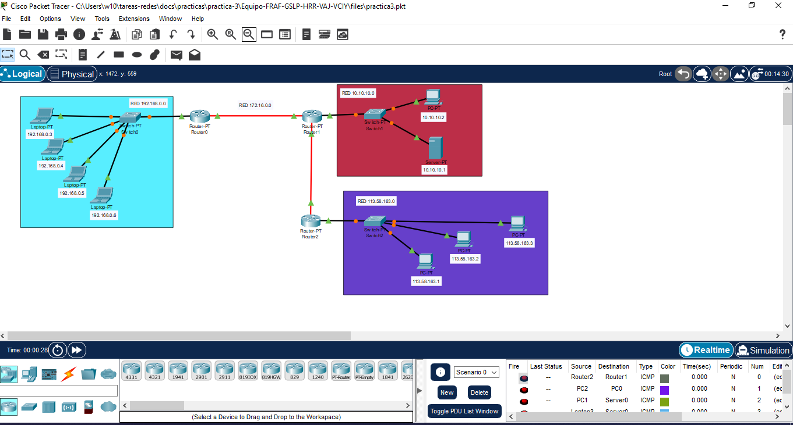      	       |
|:----------------------------------------------------:|
|Esta imagen muestra la Topología de red implementada|

| 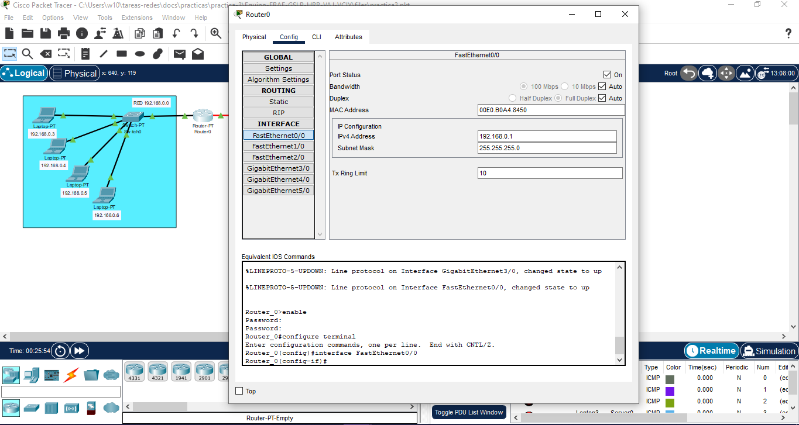      	       |
|:----------------------------------------------------:|
|Esta imagen muestra la IP Config. fastEthernet|

| 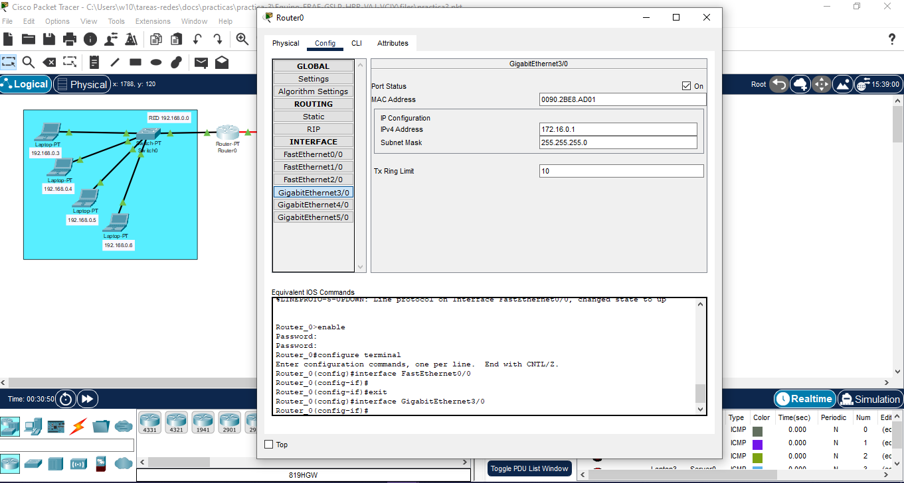      	       |
|:----------------------------------------------------:|
|Esta imagen muestra la IP Config. GigabitEthernet|

| 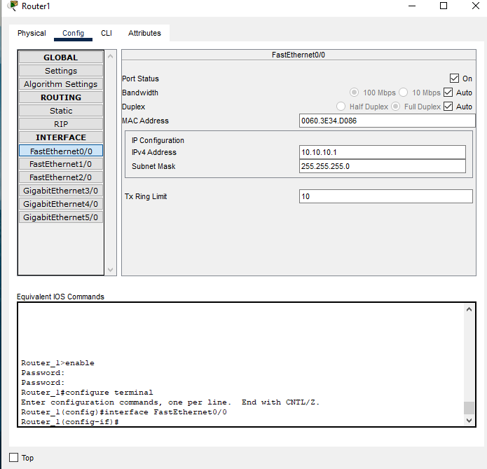      	       |
|:----------------------------------------------------:|
|Esta imagen muestra la IP Config. fastEthernet|

| 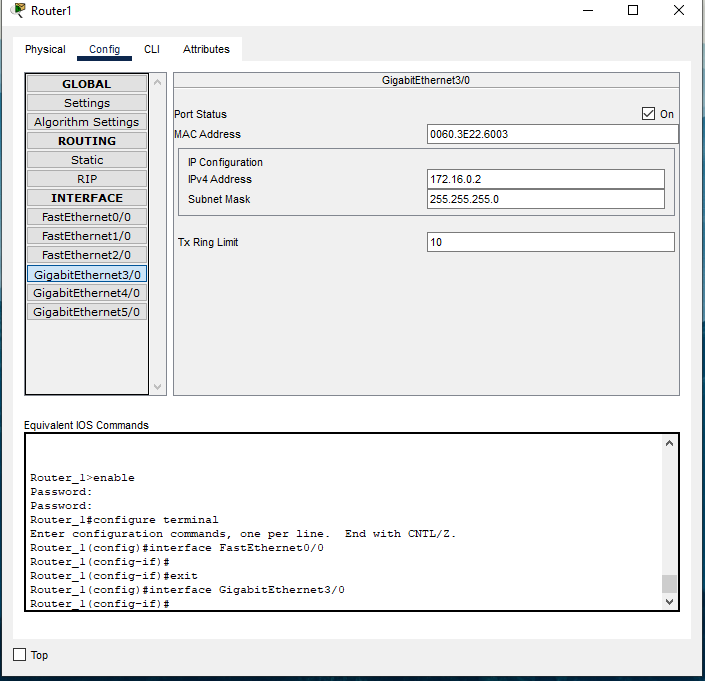      	       |
|:----------------------------------------------------:|
|Esta imagen muestra la IP Config. GigabitEthernet|

| 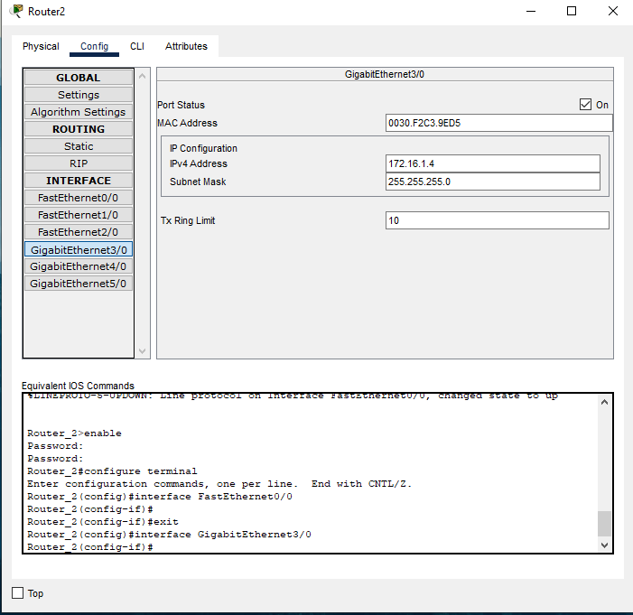      	       |
|:----------------------------------------------------:|
|Esta imagen muestra la IP Config. fastEthernet|

|       	       |
|:----------------------------------------------------:|
|Esta imagen muestra la IP Config. GigabitEthernet|

| 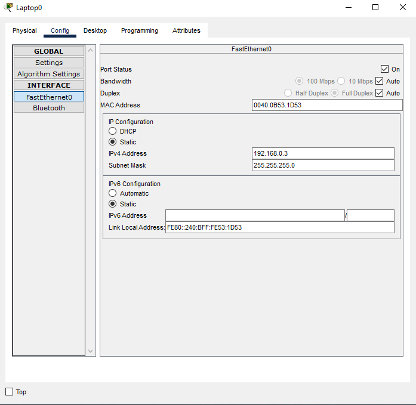      	       |
|:----------------------------------------------------:|
|Esta imagen muestra la IP Config|

| 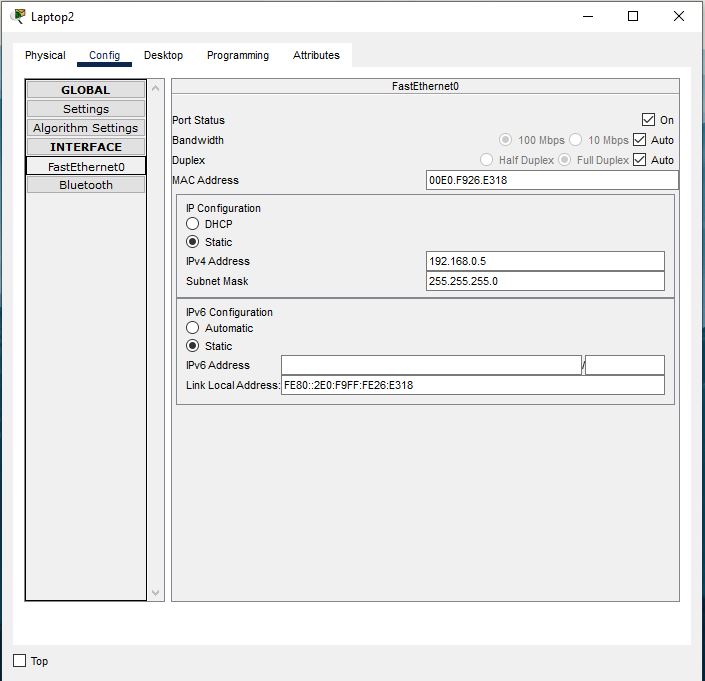      	       |
|:----------------------------------------------------:|
|Esta imagen muestra la IP Config|

|       	       |
|:----------------------------------------------------:|
|Esta imagen muestra la IP Config|

| 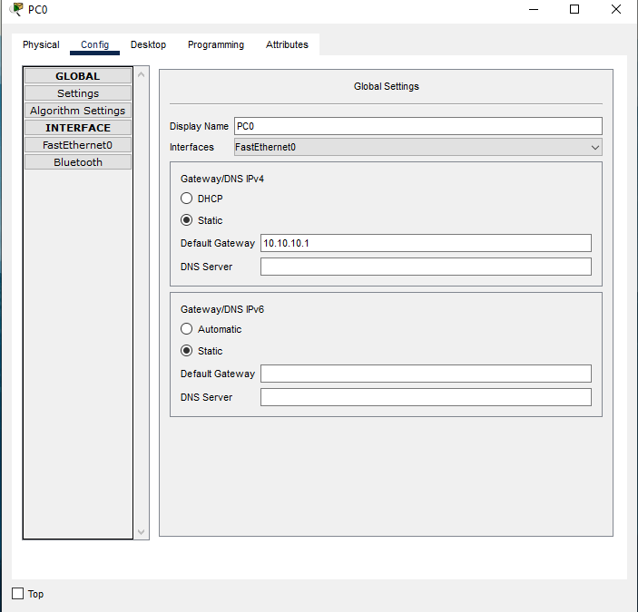      	       |
|:----------------------------------------------------:|
|Esta imagen muestra la IP Config|

| 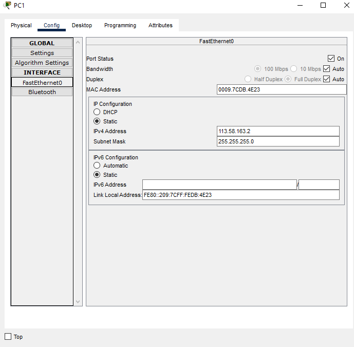      	       |
|:----------------------------------------------------:|
|Esta imagen muestra la IP Config|

| 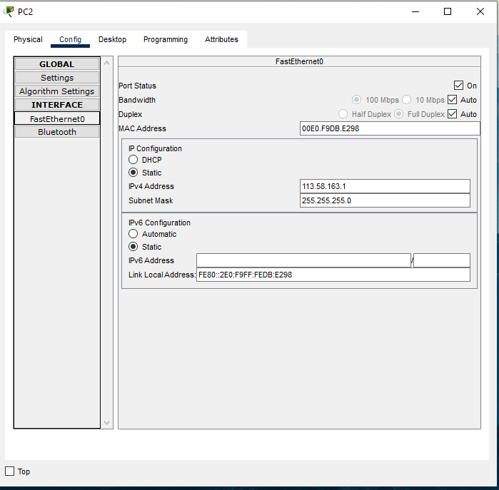      	       |
|:----------------------------------------------------:|
|Esta imagen muestra la IP Config|

| 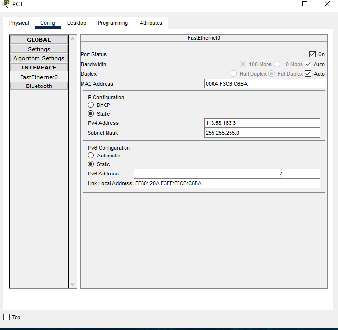      	       |
|:----------------------------------------------------:|
|Esta imagen muestra la IP Config|

### LISTADO ARCHIVOS

Salida del comando show startup-config para el [router 0](files/Router-0.txt)

Salida del comando show startup-config para el [router 1](files/Router-1.txt)

Salida del comando show startup-config para el [router 2](files/Router-2.txt)

Salida del comando show startup-config para el [switch-0](files/Switch-0.txt)

Salida del comando show startup-config para el [switch-1](files/Switch-1.txt)

Salida del comando show startup-config para el [switch-2](files/Switch-2.txt)

### TOPOLOGÍA

La topología es de árbol ya que no hay un cuarto router, en dado caso sería una topología de anillo.
Se utilizó de esta manera ya que permite conectar más dispositivos gracias a la inclusión de concentradores secundarios al igual que priorizar y aislar las comunicaciones de distintas computadoras
