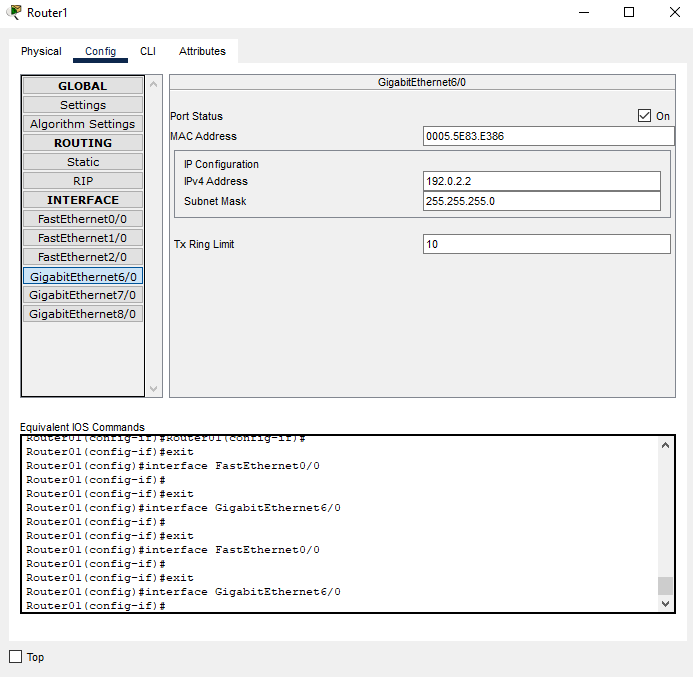

# Práctica 4 - Configuración de routers

### Equipo:

* FRAF-GSLP-HHR-VAJ-VCIY

### Integrantes

* Fernández Romero Adrián Felipe - 316093404 - AdrianFernandezR

* Gallegos Salgado Leslie Paola - 314089830 - paolagallegos

* Hérnandez Hérnandez Raúl - 308180994 - ruloCiencias

* Vázquez Alvarez Julio - 314334398 - JulsVazquez

* Velázquez Caballero Ixchel Yanira - 313119895 - Ixveca
             
### Tabla de Equipos

|Equipo | Host   |
|-------|--------|
|Router0|Router00|
```console

Router00#show cdp neighbors

Capability Codes: R - Router, T - Trans Bridge, B - Source Route Bridge
                  S - Switch, H - Host, I - IGMP, r - Repeater, P - Phone
Device ID    Local Intrfce   Holdtme    Capability   Platform    Port ID
Router02     Gig 7/0          142            R       PT1000      Gig 6/0
Router04     Gig 9/0          142            R       PT1000      Gig 6/0
Router03     Gig 8/0          142            R       PT1000      Gig 6/0
Router01     Gig 6/0          142            R       PT1000      Gig 6/0

Router00#show ip arp

Protocol  Address          Age (min)  Hardware Addr   Type   Interface
Internet  192.0.2.1               -   00D0.BA73.6744  ARPA   GigabitEthernet6/0
Internet  192.0.2.2               16  0005.5E83.E386  ARPA   GigabitEthernet6/0
Internet  192.0.3.1               -   0060.5C89.569C  ARPA   GigabitEthernet7/0
Internet  192.0.3.2               16  0003.E467.D116  ARPA   GigabitEthernet7/0
Internet  192.0.4.1               -   0000.0C67.7363  ARPA   GigabitEthernet8/0
Internet  192.0.4.2               16  00E0.F78B.25E6  ARPA   GigabitEthernet8/0
Internet  192.0.5.1               -   0060.3ED0.CA09  ARPA   GigabitEthernet9/0
Internet  192.0.5.2               16  00D0.D30E.4360  ARPA   GigabitEthernet9/0
Internet  192.168.5.1             -   0000.0CB8.1444  ARPA   FastEthernet0/0
Internet  192.168.5.2             0   0090.0C63.D615  ARPA   FastEthernet0/0


Router00#show ip interface brief

Interface              IP-Address      OK? Method Status                Protocol 
FastEthernet0/0        192.168.5.1     YES manual up                    up 
FastEthernet1/0        unassigned      YES unset  administratively down down 
FastEthernet2/0        unassigned      YES unset  administratively down down 
GigabitEthernet6/0     192.0.2.1       YES manual up                    up 
GigabitEthernet7/0     192.0.3.1       YES manual up                    up 
GigabitEthernet8/0     192.0.4.1       YES manual up                    up 
GigabitEthernet9/0     192.0.5.1       YES manual up                    up

Router00#show ip route

Codes: C - connected, S - static, I - IGRP, R - RIP, M - mobile, B - BGP
       D - EIGRP, EX - EIGRP external, O - OSPF, IA - OSPF inter area
       N1 - OSPF NSSA external type 1, N2 - OSPF NSSA external type 2
       E1 - OSPF external type 1, E2 - OSPF external type 2, E - EGP
       i - IS-IS, L1 - IS-IS level-1, L2 - IS-IS level-2, ia - IS-IS inter area
       * - candidate default, U - per-user static route, o - ODR
       P - periodic downloaded static route

Gateway of last resort is not set

R    10.0.0.0/8 [120/1] via 192.0.2.2, 00:00:20, GigabitEthernet6/0
                [120/1] via 192.0.3.2, 00:00:03, GigabitEthernet7/0
                [120/1] via 192.0.4.2, 00:00:18, GigabitEthernet8/0
                [120/1] via 192.0.5.2, 00:00:14, GigabitEthernet9/0
C    192.0.2.0/24 is directly connected, GigabitEthernet6/0
C    192.0.3.0/24 is directly connected, GigabitEthernet7/0
C    192.0.4.0/24 is directly connected, GigabitEthernet8/0
C    192.0.5.0/24 is directly connected, GigabitEthernet9/0
R    192.168.1.0/24 [120/1] via 192.0.2.2, 00:00:20, GigabitEthernet6/0
R    192.168.2.0/24 [120/1] via 192.0.3.2, 00:00:03, GigabitEthernet7/0
R    192.168.3.0/24 [120/1] via 192.0.4.2, 00:00:18, GigabitEthernet8/0
R    192.168.4.0/24 [120/1] via 192.0.5.2, 00:00:14, GigabitEthernet9/0
 
Router00#show ip route summary

IP routing table name is Default-IP-Routing-Table(0)
IP routing table maximum-paths is 16
Route Source    Networks    Subnets     Overhead    Memory (bytes)
connected       5           0           360         640
static          0           0           0           0
rip             5           0           360         640
Total           10          0           720         1280

Router00#show ip route dhcp	
|
Translating "dhcp"...domain server (255.255.255.255)
% Invalid input detected

Router00#show ip nat statistics
show ip dhcp server statistics
Router00#show ip nat translations

Router00#show ip rip database
10.0.0.0/8    auto-summary
10.0.0.0/8
    [1] via 192.0.2.2, 00:00:10, GigabitEthernet6/0    [1] via 192.0.3.2, 00:00:00, GigabitEthernet7/0    [1] via 192.0.4.2, 00:00:23, GigabitEthernet8/0    [1] via 192.0.5.2, 00:00:10, GigabitEthernet9/0
192.0.2.0/24    auto-summary
192.0.2.0/24    directly connected, GigabitEthernet6/0
192.0.3.0/24    auto-summary
192.0.3.0/24    directly connected, GigabitEthernet7/0
192.0.4.0/24    auto-summary
192.0.4.0/24    directly connected, GigabitEthernet8/0
192.0.5.0/24    auto-summary
192.0.5.0/24    directly connected, GigabitEthernet9/0
192.168.1.0/24    auto-summary
192.168.1.0/24
    [1] via 192.0.2.2, 00:00:10, GigabitEthernet6/0
192.168.2.0/24    auto-summary
192.168.2.0/24
    [1] via 192.0.3.2, 00:00:00, GigabitEthernet7/0
192.168.3.0/24    auto-summary
192.168.3.0/24
    [1] via 192.0.4.2, 00:00:23, GigabitEthernet8/0
192.168.4.0/24    auto-summary
192.168.4.0/24
    [1] via 192.0.5.2, 00:00:10, GigabitEthernet9/0
192.168.5.0/24    auto-summary
192.168.5.0/24    directly connected, FastEthernet0/0


```
|Equipo | Host   |
|-------|--------|
|Router1|Router01|
```console

Router01#show cdp neighbors

Capability Codes: R - Router, T - Trans Bridge, B - Source Route Bridge
                  S - Switch, H - Host, I - IGMP, r - Repeater, P - Phone
Device ID    Local Intrfce   Holdtme    Capability   Platform    Port ID
Switch       Fas 1/0          141            S       PT3000      Fas 1/1
Switch       Fas 0/0          141            S       PT3000      Fas 0/1
Router00     Gig 6/0          141            R       PT1000      Gig 6/0

Router01#show ip arp

Protocol  Address          Age (min)  Hardware Addr   Type   Interface
Internet  10.0.1.0                -   0001.C915.DBCD  ARPA   FastEthernet1/0
Internet  192.0.2.1               47  00D0.BA73.6744  ARPA   GigabitEthernet6/0
Internet  192.0.2.2               -   0005.5E83.E386  ARPA   GigabitEthernet6/0
Internet  192.168.1.1             -   00D0.BA88.8B3C  ARPA   FastEthernet0/0

Router01#show ip interface brief

Interface              IP-Address      OK? Method Status                Protocol 
FastEthernet0/0        192.168.1.1     YES NVRAM  up                    up 
FastEthernet1/0        10.0.1.0        YES manual up                    up 
FastEthernet2/0        unassigned      YES NVRAM  administratively down down 
GigabitEthernet6/0     192.0.2.2       YES NVRAM  up                    up 
GigabitEthernet7/0     unassigned      YES NVRAM  administratively down down 
GigabitEthernet8/0     unassigned      YES NVRAM  administratively down down

Router01#show ip route

Codes: C - connected, S - static, I - IGRP, R - RIP, M - mobile, B - BGP
       D - EIGRP, EX - EIGRP external, O - OSPF, IA - OSPF inter area
       N1 - OSPF NSSA external type 1, N2 - OSPF NSSA external type 2
       E1 - OSPF external type 1, E2 - OSPF external type 2, E - EGP
       i - IS-IS, L1 - IS-IS level-1, L2 - IS-IS level-2, ia - IS-IS inter area
       * - candidate default, U - per-user static route, o - ODR
       P - periodic downloaded static route

Gateway of last resort is not set

C    10.0.0.0/8 is directly connected, FastEthernet1/0
C    192.0.2.0/24 is directly connected, GigabitEthernet6/0
R    192.0.3.0/24 [120/1] via 192.0.2.1, 00:00:03, GigabitEthernet6/0
R    192.0.4.0/24 [120/1] via 192.0.2.1, 00:00:03, GigabitEthernet6/0
R    192.0.5.0/24 [120/1] via 192.0.2.1, 00:00:03, GigabitEthernet6/0
C    192.168.1.0/24 is directly connected, FastEthernet0/0
R    192.168.2.0/24 [120/2] via 192.0.2.1, 00:00:03, GigabitEthernet6/0
R    192.168.3.0/24 [120/2] via 192.0.2.1, 00:00:03, GigabitEthernet6/0
R    192.168.4.0/24 [120/2] via 192.0.2.1, 00:00:03, GigabitEthernet6/0

Router01#show ip route summary

IP routing table name is Default-IP-Routing-Table(0)
IP routing table maximum-paths is 16
Route Source    Networks    Subnets     Overhead    Memory (bytes)
connected       2           1           216         384
static          0           0           0           0
rip             7           0           504         896
internal        1                                   1148
Total           10          1           720         2428


Router01#show ip route dhcp	
Translating "dhcp"...domain server (255.255.255.255)
% Invalid input detected

Router01#show ip nat statistics
Router01#show ip nat translations

Router01show ip rip database
10.0.0.0/8    auto-summary
10.0.0.0/8    directly connected, FastEthernet1/0
192.0.2.0/24    auto-summary
192.0.2.0/24    directly connected, GigabitEthernet6/0
192.0.3.0/24    auto-summary
192.0.3.0/24
    [1] via 192.0.2.1, 00:00:20, GigabitEthernet6/0
192.0.4.0/24    auto-summary
192.0.4.0/24
    [1] via 192.0.2.1, 00:00:20, GigabitEthernet6/0
192.0.5.0/24    auto-summary
192.0.5.0/24
    [1] via 192.0.2.1, 00:00:20, GigabitEthernet6/0
192.168.1.0/24    auto-summary
192.168.1.0/24    directly connected, FastEthernet0/0
192.168.2.0/24    auto-summary
192.168.2.0/24
    [2] via 192.0.2.1, 00:00:20, GigabitEthernet6/0
192.168.3.0/24    auto-summary
192.168.3.0/24
    [2] via 192.0.2.1, 00:00:20, GigabitEthernet6/0
192.168.4.0/24    auto-summary
192.168.4.0/24
    [2] via 192.0.2.1, 00:00:20, GigabitEthernet6/0

```
|Equipo | Host   |
|-------|--------|
|Router2|Router02|
```console    

Router02#show cdp neighbors

Capability Codes: R - Router, T - Trans Bridge, B - Source Route Bridge
                  S - Switch, H - Host, I - IGMP, r - Repeater, P - Phone
Device ID    Local Intrfce   Holdtme    Capability   Platform    Port ID
Switch       Fas 0/0          122            S       PT3000      Fas 0/1
Switch       Fas 1/0          122            S       PT3000      Fas 0/1
Router00     Gig 6/0          122            R       PT1000      Gig 7/0

Router02#show ip arp

Protocol  Address          Age (min)  Hardware Addr   Type   Interface
Internet  10.0.2.1                -   0001.4237.5BCC  ARPA   FastEthernet1/0
Internet  192.0.3.1               98  0060.5C89.569C  ARPA   GigabitEthernet6/0
Internet  192.0.3.2               -   0003.E467.D116  ARPA   GigabitEthernet6/0
Internet  192.168.2.1             -   0010.11AA.D25A  ARPA   FastEthernet0/0

Router02>show ip interface brief

Interface              IP-Address      OK? Method Status                Protocol 
FastEthernet0/0        192.168.2.1     YES NVRAM  up                    up 
FastEthernet1/0        10.0.2.1        YES NVRAM  up                    up 
FastEthernet2/0        unassigned      YES NVRAM  administratively down down 
GigabitEthernet6/0     192.0.3.2       YES NVRAM  up                    up 
GigabitEthernet7/0     unassigned      YES NVRAM  administratively down down 
GigabitEthernet8/0     unassigned      YES NVRAM  administratively down down

Router02#show ip route

Codes: C - connected, S - static, I - IGRP, R - RIP, M - mobile, B - BGP
       D - EIGRP, EX - EIGRP external, O - OSPF, IA - OSPF inter area
       N1 - OSPF NSSA external type 1, N2 - OSPF NSSA external type 2
       E1 - OSPF external type 1, E2 - OSPF external type 2, E - EGP
       i - IS-IS, L1 - IS-IS level-1, L2 - IS-IS level-2, ia - IS-IS inter area
       * - candidate default, U - per-user static route, o - ODR
       P - periodic downloaded static route

Gateway of last resort is not set

     10.0.0.0/24 is subnetted, 1 subnets
C       10.0.2.0 is directly connected, FastEthernet1/0
R    192.0.2.0/24 [120/1] via 192.0.3.1, 00:00:29, GigabitEthernet6/0
C    192.0.3.0/24 is directly connected, GigabitEthernet6/0
R    192.0.4.0/24 [120/1] via 192.0.3.1, 00:00:29, GigabitEthernet6/0
R    192.0.5.0/24 [120/1] via 192.0.3.1, 00:00:29, GigabitEthernet6/0
R    192.168.1.0/24 [120/2] via 192.0.3.1, 00:00:29, GigabitEthernet6/0
C    192.168.2.0/24 is directly connected, FastEthernet0/0
R    192.168.3.0/24 [120/2] via 192.0.3.1, 00:00:29, GigabitEthernet6/0
R    192.168.4.0/24 [120/2] via 192.0.3.1, 00:00:29, GigabitEthernet6/0
R    192.168.5.0/24 [120/1] via 192.0.3.1, 00:00:29, GigabitEthernet6/0

Router02#show ip route summary

IP routing table name is Default-IP-Routing-Table(0)
IP routing table maximum-paths is 16
Route Source    Networks    Subnets     Overhead    Memory (bytes)
connected       3           0           216         384
static          0           0           0           0
rip             6           0           432         768
Total           9           0           648         1152

Router02#show ip route dhcp
Translating "dhcp"...domain server (255.255.255.255)
% Invalid input detected

show ip nat statistics
show ip nat translations

Router02#show ip rip database

10.0.0.0/8    auto-summary
10.0.0.0/8    directly connected, FastEthernet1/0
192.0.2.0/24    auto-summary
192.0.2.0/24
    [1] via 192.0.3.1, 00:00:08, GigabitEthernet6/0
192.0.3.0/24    auto-summary
192.0.3.0/24    directly connected, GigabitEthernet6/0
192.0.4.0/24    auto-summary
192.0.4.0/24
    [1] via 192.0.3.1, 00:00:08, GigabitEthernet6/0
192.0.5.0/24    auto-summary
192.0.5.0/24
    [1] via 192.0.3.1, 00:00:08, GigabitEthernet6/0
192.168.1.0/24    auto-summary
192.168.1.0/24
    [2] via 192.0.3.1, 00:00:08, GigabitEthernet6/0
192.168.2.0/24    auto-summary
192.168.2.0/24    directly connected, FastEthernet0/0
192.168.3.0/24    auto-summary
192.168.3.0/24
    [2] via 192.0.3.1, 00:00:08, GigabitEthernet6/0
192.168.4.0/24    auto-summary
192.168.4.0/24
    [2] via 192.0.3.1, 00:00:08, GigabitEthernet6/0

```
|Equipo | Host   |
|-------|--------|
|Router3|Router03|
```console  

Router03#show cdp neighbors

Capability Codes: R - Router, T - Trans Bridge, B - Source Route Bridge
                  S - Switch, H - Host, I - IGMP, r - Repeater, P - Phone
Device ID    Local Intrfce   Holdtme    Capability   Platform    Port ID
Switch       Fas 1/0          131            S       PT3000      Fas 0/1
Router00     Gig 6/0          131            R       PT1000      Gig 8/0
Switch       Fas 0/0          131            S       PT3000      Fas 0/1

Router03#show ip arp

Protocol  Address          Age (min)  Hardware Addr   Type   Interface
Internet  10.0.3.1                -   0002.171E.D774  ARPA   FastEthernet1/0
Internet  192.0.4.1               116 0000.0C67.7363  ARPA   GigabitEthernet6/0
Internet  192.0.4.2               -   00E0.F78B.25E6  ARPA   GigabitEthernet6/0
Internet  192.168.3.1             -   0001.64EB.46E1  ARPA   FastEthernet0/0

Router03>show ip interface brief

Interface              IP-Address      OK? Method Status                Protocol 
FastEthernet0/0        192.168.3.1     YES NVRAM  up                    up 
FastEthernet1/0        10.0.3.1        YES NVRAM  up                    up 
FastEthernet2/0        unassigned      YES NVRAM  administratively down down 
GigabitEthernet6/0     192.0.4.2       YES NVRAM  up                    up 
GigabitEthernet7/0     unassigned      YES NVRAM  administratively down down 
GigabitEthernet8/0     unassigned      YES NVRAM  administratively down down

Router03#show ip route

Codes: C - connected, S - static, I - IGRP, R - RIP, M - mobile, B - BGP
       D - EIGRP, EX - EIGRP external, O - OSPF, IA - OSPF inter area
       N1 - OSPF NSSA external type 1, N2 - OSPF NSSA external type 2
       E1 - OSPF external type 1, E2 - OSPF external type 2, E - EGP
       i - IS-IS, L1 - IS-IS level-1, L2 - IS-IS level-2, ia - IS-IS inter area
       * - candidate default, U - per-user static route, o - ODR
       P - periodic downloaded static route

Gateway of last resort is not set

     10.0.0.0/24 is subnetted, 1 subnets
C       10.0.3.0 is directly connected, FastEthernet1/0
R    192.0.2.0/24 [120/1] via 192.0.4.1, 00:00:27, GigabitEthernet6/0
R    192.0.3.0/24 [120/1] via 192.0.4.1, 00:00:27, GigabitEthernet6/0
C    192.0.4.0/24 is directly connected, GigabitEthernet6/0
R    192.0.5.0/24 [120/1] via 192.0.4.1, 00:00:27, GigabitEthernet6/0
R    192.168.1.0/24 [120/2] via 192.0.4.1, 00:00:27, GigabitEthernet6/0
R    192.168.2.0/24 [120/2] via 192.0.4.1, 00:00:27, GigabitEthernet6/0
C    192.168.3.0/24 is directly connected, FastEthernet0/0
R    192.168.4.0/24 [120/2] via 192.0.4.1, 00:00:27, GigabitEthernet6/0
R    192.168.5.0/24 [120/1] via 192.0.4.1, 00:00:27, GigabitEthernet6/0

Router03>show ip route summary

IP routing table name is Default-IP-Routing-Table(0)
IP routing table maximum-paths is 16
Route Source    Networks    Subnets     Overhead    Memory (bytes)
connected       2           1           216         384
static          0           0           0           0
rip             7           0           504         896
internal        1                                   1148
Total           10          1           720         2428

Router03#show ip route dhcp

Translating "dhcp"...domain server (255.255.255.255)
% Invalid input detected

show ip nat statistics
show ip nat translations

Router03#show ip rip database

10.0.3.0/24    auto-summary
10.0.3.0/24    directly connected, FastEthernet1/0
192.0.2.0/24    auto-summary
192.0.2.0/24
    [1] via 192.0.4.1, 00:00:17, GigabitEthernet6/0
192.0.3.0/24    auto-summary
192.0.3.0/24
    [1] via 192.0.4.1, 00:00:17, GigabitEthernet6/0
192.0.4.0/24    auto-summary
192.0.4.0/24    directly connected, GigabitEthernet6/0
192.0.5.0/24    auto-summary
192.0.5.0/24
    [1] via 192.0.4.1, 00:00:17, GigabitEthernet6/0
192.168.1.0/24    auto-summary
192.168.1.0/24
    [2] via 192.0.4.1, 00:00:17, GigabitEthernet6/0
192.168.2.0/24    auto-summary
192.168.2.0/24
    [2] via 192.0.4.1, 00:00:17, GigabitEthernet6/0
192.168.3.0/24    auto-summary
192.168.3.0/24    directly connected, FastEthernet0/0
192.168.4.0/24    auto-summary
192.168.4.0/24
    [2] via 192.0.4.1, 00:00:17, GigabitEthernet6/0
192.168.5.0/24    auto-summary
192.168.5.0/24
    [1] via 192.0.4.1, 00:00:17, GigabitEthernet6/0

```
|Equipo | Host   |
|-------|--------|
|Router4|Router04|
```console  

Router04#show cdp neighbors
Capability Codes: R - Router, T - Trans Bridge, B - Source Route Bridge
                  S - Switch, H - Host, I - IGMP, r - Repeater, P - Phone
Device ID    Local Intrfce   Holdtme    Capability   Platform    Port ID
Switch       Fas 0/0          152            S       PT3000      Fas 1/1
Switch       Fas 1/0          152            S       PT3000      Fas 0/1
Router00     Gig 6/0          152            R       PT1000      Gig 9/0

Router04#show ip arp

Protocol  Address          Age (min)  Hardware Addr   Type   Interface
Internet  10.0.4.1                -   0001.4233.1809  ARPA   FastEthernet1/0
Internet  192.0.5.1               122 0060.3ED0.CA09  ARPA   GigabitEthernet6/0
Internet  192.0.5.2               -   00D0.D30E.4360  ARPA   GigabitEthernet6/0
Internet  192.168.4.1             -   00D0.97D5.E978  ARPA   FastEthernet0/0

Router04#show ip interface brief

Interface              IP-Address      OK? Method Status                Protocol 
FastEthernet0/0        192.168.4.1     YES NVRAM  up                    up 
FastEthernet1/0        10.0.4.1        YES NVRAM  up                    up 
FastEthernet2/0        unassigned      YES NVRAM  administratively down down 
GigabitEthernet6/0     192.0.5.2       YES NVRAM  up                    up 
GigabitEthernet7/0     unassigned      YES NVRAM  administratively down down 
GigabitEthernet8/0     unassigned      YES NVRAM  administratively down down

Router04#show ip route
Codes: C - connected, S - static, I - IGRP, R - RIP, M - mobile, B - BGP
       D - EIGRP, EX - EIGRP external, O - OSPF, IA - OSPF inter area
       N1 - OSPF NSSA external type 1, N2 - OSPF NSSA external type 2
       E1 - OSPF external type 1, E2 - OSPF external type 2, E - EGP
       i - IS-IS, L1 - IS-IS level-1, L2 - IS-IS level-2, ia - IS-IS inter area
       * - candidate default, U - per-user static route, o - ODR
       P - periodic downloaded static route

Gateway of last resort is not set

     10.0.0.0/24 is subnetted, 1 subnets
C       10.0.4.0 is directly connected, FastEthernet1/0
R    192.0.2.0/24 [120/1] via 192.0.5.1, 00:00:25, GigabitEthernet6/0
R    192.0.3.0/24 [120/1] via 192.0.5.1, 00:00:25, GigabitEthernet6/0
R    192.0.4.0/24 [120/1] via 192.0.5.1, 00:00:25, GigabitEthernet6/0
C    192.0.5.0/24 is directly connected, GigabitEthernet6/0
R    192.168.1.0/24 [120/2] via 192.0.5.1, 00:00:25, GigabitEthernet6/0
R    192.168.2.0/24 [120/2] via 192.0.5.1, 00:00:25, GigabitEthernet6/0
R    192.168.3.0/24 [120/2] via 192.0.5.1, 00:00:25, GigabitEthernet6/0
C    192.168.4.0/24 is directly connected, FastEthernet0/0
R    192.168.5.0/24 [120/1] via 192.0.5.1, 00:00:25, GigabitEthernet6/0

Router04#show ip route summary

IP routing table name is Default-IP-Routing-Table(0)
IP routing table maximum-paths is 16
Route Source    Networks    Subnets     Overhead    Memory (bytes)
connected       2           1           216         384
static          0           0           0           0
rip             7           0           504         896
internal        1                                   1148
Total           10          1           720         2428


Router04#show ip route dhcp
Translating "dhcp"...domain server (255.255.255.255)
% Invalid input detected

show ip nat statistics
show ip nat translations

Router04#show ip rip database

10.0.4.0/24    auto-summary
10.0.4.0/24    directly connected, FastEthernet1/0
192.0.2.0/24    auto-summary
192.0.2.0/24
    [1] via 192.0.5.1, 00:00:22, GigabitEthernet6/0
192.0.3.0/24    auto-summary
192.0.3.0/24
    [1] via 192.0.5.1, 00:00:22, GigabitEthernet6/0
192.0.4.0/24    auto-summary
192.0.4.0/24
    [1] via 192.0.5.1, 00:00:22, GigabitEthernet6/0
192.0.5.0/24    auto-summary
192.0.5.0/24    directly connected, GigabitEthernet6/0
192.168.1.0/24    auto-summary
192.168.1.0/24
    [2] via 192.0.5.1, 00:00:22, GigabitEthernet6/0
192.168.2.0/24    auto-summary
192.168.2.0/24
    [2] via 192.0.5.1, 00:00:22, GigabitEthernet6/0
192.168.3.0/24    auto-summary
192.168.3.0/24
    [2] via 192.0.5.1, 00:00:22, GigabitEthernet6/0
192.168.4.0/24    auto-summary
192.168.4.0/24    directly connected, FastEthernet0/0
192.168.5.0/24    auto-summary
192.168.5.0/24
    [1] via 192.0.5.1, 00:00:22, GigabitEthernet6/0


```
|Equipo      | Host   |
|------------|--------|
|Switch-1-LAN|Switch  |
```console  

Switch#show cdp neighbors

Capability Codes: R - Router, T - Trans Bridge, B - Source Route Bridge
                  S - Switch, H - Host, I - IGMP, r - Repeater, P - Phone
Device ID    Local Intrfce   Holdtme    Capability   Platform    Port ID
Router01     Fas 0/1          141            R       PT1000      Fas 0/0

Switch#show ip interface brief

Interface              IP-Address      OK? Method Status                Protocol 
FastEthernet0/1        unassigned      YES manual up                    up 
FastEthernet1/1        unassigned      YES manual up                    up 
FastEthernet2/1        unassigned      YES manual down                  down 
FastEthernet3/1        unassigned      YES manual down                  down 
FastEthernet4/1        unassigned      YES manual down                  down 
FastEthernet5/1        unassigned      YES manual down                  down 
Vlan1                  unassigned      YES manual administratively down down


```
|Equipo      | Host   |
|------------|--------|
|Switch-2-LAN|Switch  |
```console  

Switch#show cdp neighbors

Capability Codes: R - Router, T - Trans Bridge, B - Source Route Bridge
                  S - Switch, H - Host, I - IGMP, r - Repeater, P - Phone
Device ID    Local Intrfce   Holdtme    Capability   Platform    Port ID
Router02     Fas 0/1          148            R       PT1000      Fas 0/0

Switch#show ip interface brief

Interface              IP-Address      OK? Method Status                Protocol 
FastEthernet0/1        unassigned      YES manual up                    up 
FastEthernet1/1        unassigned      YES manual up                    up 
FastEthernet2/1        unassigned      YES manual down                  down 
FastEthernet3/1        unassigned      YES manual down                  down 
FastEthernet4/1        unassigned      YES manual down                  down 
FastEthernet5/1        unassigned      YES manual down                  down 
Vlan1                  unassigned      YES manual administratively down down


```
|Equipo      | Host   |
|------------|--------|
|Switch-3-LAN|Switch  |
```console 

	
Switch#show cdp neighbors

Capability Codes: R - Router, T - Trans Bridge, B - Source Route Bridge
                  S - Switch, H - Host, I - IGMP, r - Repeater, P - Phone
Device ID    Local Intrfce   Holdtme    Capability   Platform    Port ID
Switch       Fas 1/0          131            S       PT3000      Fas 0/1
Router00     Gig 6/0          131            R       PT1000      Gig 8/0
Switch       Fas 0/0          131            S       PT3000      Fas 0/1

Switch#show ip interface brief

Interface              IP-Address      OK? Method Status                Protocol 
FastEthernet0/1        unassigned      YES manual up                    up 
FastEthernet1/1        unassigned      YES manual up                    up 
FastEthernet2/1        unassigned      YES manual down                  down 
FastEthernet3/1        unassigned      YES manual down                  down 
FastEthernet4/1        unassigned      YES manual down                  down 
FastEthernet5/1        unassigned      YES manual down                  down 
Vlan1                  unassigned      YES manual administratively down down

show ip arp
show ip route
show ip route summary
show ip dhcp
show ip nat statistics
show ip nat translations
show ip rip database

```
|Equipo      | Host   |
|------------|--------|
|Switch-4-LAN|Switch  |
```console 

Switch#show cdp neighbors

Capability Codes: R - Router, T - Trans Bridge, B - Source Route Bridge
                  S - Switch, H - Host, I - IGMP, r - Repeater, P - Phone
Device ID    Local Intrfce   Holdtme    Capability   Platform    Port ID
Router04     Fas 0/1          175            R       PT1000      Fas 1/0


Switch>show ip interface brief

Interface              IP-Address      OK? Method Status                Protocol 
FastEthernet0/1        unassigned      YES manual up                    up 
FastEthernet1/1        unassigned      YES manual up                    up 
FastEthernet2/1        unassigned      YES manual down                  down 
FastEthernet3/1        unassigned      YES manual down                  down 
FastEthernet4/1        unassigned      YES manual down                  down 
FastEthernet5/1        unassigned      YES manual down                  down 
Vlan1                  unassigned      YES manual administratively down down


```
|Equipo      | Host   |
|------------|--------|
|Switch-1-DMZ|Switch  |
```console  

Switch#show cdp neighbors 

Capability Codes: R - Router, T - Trans Bridge, B - Source Route Bridge
                  S - Switch, H - Host, I - IGMP, r - Repeater, P - Phone
Device ID    Local Intrfce   Holdtme    Capability   Platform    Port ID
Router01     Fas 1/1          152            R       PT1000      Fas 1/0

Switch#show ip interface brief

Interface              IP-Address      OK? Method Status                Protocol 
FastEthernet0/1        unassigned      YES manual up                    up 
FastEthernet1/1        unassigned      YES manual up                    up 
FastEthernet2/1        unassigned      YES manual down                  down 
FastEthernet3/1        unassigned      YES manual down                  down 
FastEthernet4/1        unassigned      YES manual down                  down 
FastEthernet5/1        unassigned      YES manual down                  down 
Vlan1                  unassigned      YES manual administratively down down


```
|Equipo      | Host   |
|------------|--------|
|Switch-2-DMZ|Switch  |
```console  

Switch#show cdp neighbors

Capability Codes: R - Router, T - Trans Bridge, B - Source Route Bridge
                  S - Switch, H - Host, I - IGMP, r - Repeater, P - Phone
Device ID    Local Intrfce   Holdtme    Capability   Platform    Port ID
Router02     Fas 0/1          122            R       PT1000      Fas 1/0

Switch#show ip interface brief

Interface              IP-Address      OK? Method Status                Protocol 
FastEthernet0/1        unassigned      YES manual up                    up 
FastEthernet1/1        unassigned      YES manual up                    up 
FastEthernet2/1        unassigned      YES manual down                  down 
FastEthernet3/1        unassigned      YES manual down                  down 
FastEthernet4/1        unassigned      YES manual down                  down 
FastEthernet5/1        unassigned      YES manual down                  down 
Vlan1                  unassigned      YES manual administratively down down


```
|Equipo      | Host   |
|------------|--------|
|Switch-3-DMZ|Switch  |
```console  

Switch#show cdp neighbors

Capability Codes: R - Router, T - Trans Bridge, B - Source Route Bridge
                  S - Switch, H - Host, I - IGMP, r - Repeater, P - Phone
Device ID    Local Intrfce   Holdtme    Capability   Platform    Port ID
Router03     Fas 0/1          152            R       PT1000      Fas 1/0

Switch#show ip interface brief

Interface              IP-Address      OK? Method Status                Protocol 
FastEthernet0/1        unassigned      YES manual up                    up 
FastEthernet1/1        unassigned      YES manual up                    up 
FastEthernet2/1        unassigned      YES manual down                  down 
FastEthernet3/1        unassigned      YES manual down                  down 
FastEthernet4/1        unassigned      YES manual down                  down 
FastEthernet5/1        unassigned      YES manual down                  down 
Vlan1                  unassigned      YES manual administratively down down


```
|Equipo      | Host   |
|------------|--------|
|Switch-4-DMZ|Switch  |
```console  

Switch#show cdp neighbors

Capability Codes: R - Router, T - Trans Bridge, B - Source Route Bridge
                  S - Switch, H - Host, I - IGMP, r - Repeater, P - Phone
Device ID    Local Intrfce   Holdtme    Capability   Platform    Port ID
Router04     Fas 0/1          151            R       PT1000      Fas 1/0

Switch#show ip interface brief

Interface              IP-Address      OK? Method Status                Protocol 
FastEthernet0/1        unassigned      YES manual up                    up 
FastEthernet1/1        unassigned      YES manual up                    up 
FastEthernet2/1        unassigned      YES manual down                  down 
FastEthernet3/1        unassigned      YES manual down                  down 
FastEthernet4/1        unassigned      YES manual down                  down 
FastEthernet5/1        unassigned      YES manual down                  down 
Vlan1                  unassigned      YES manual administratively down down

show ip arp
show ip route
show ip route summary
show ip dhcp
show ip nat statistics
show ip nat translations
show ip rip database
```


### LISTADO IMÁGENES
|       	       |
|:----------------------------------------------------:|
|Esta imagen muestra la Topología de red implementada|

|       	       |
|:----------------------------------------------------:|
|Esta imagen muestra la IP Config. fastEthernet|

|       	       |
|:----------------------------------------------------:|
|Esta imagen muestra la IP Config. GigabitEthernet|

|       	       |
|:----------------------------------------------------:|
|Esta imagen muestra la IP Config. fastEthernet|

|       	       |
|:----------------------------------------------------:|
|Esta imagen muestra la IP Config. GigabitEthernet|

|       	       |
|:----------------------------------------------------:|
|Esta imagen muestra la IP Config. fastEthernet|

|       	       |
|:----------------------------------------------------:|
|Esta imagen muestra la IP Config. GigabitEthernet|

|       	       |
|:----------------------------------------------------:|
|Esta imagen muestra la IP Config. fastEthernet|

|       	       |
|:----------------------------------------------------:|
|Esta imagen muestra la IP Config. GigabitEthernet|

|       	       |
|:----------------------------------------------------:|
|Esta imagen muestra la IP Config. fastEthernet|

|       	       |
|:----------------------------------------------------:|
|Esta imagen muestra la IP Config. GigabitEthernet|

|       	       |
|:----------------------------------------------------:|
|Esta imagen muestra la IP Config|

|       	       |
|:----------------------------------------------------:|
|Esta imagen muestra la IP Config|


|       	       |
|:----------------------------------------------------:|
|Esta imagen muestra la IP Config|

|       	       |
|:----------------------------------------------------:|
|Esta imagen muestra la IP Config|

|       	       |
|:----------------------------------------------------:|
|Esta imagen muestra la IP Config|

|       	       |
|:----------------------------------------------------:|
|Esta imagen muestra la IP Config|

|       	       |
|:----------------------------------------------------:|
|Esta imagen muestra la IP Config|

|       	       |
|:----------------------------------------------------:|
|Esta imagen muestra la IP Config|

|       	       |
|:----------------------------------------------------:|
|Esta imagen muestra la IP Config|

### LISTADO ARCHIVOS

Salida del comando show startup-config para el [router 0](files/Router-0.txt)

Salida del comando show startup-config para el [router 1](files/Router-1.txt)

Salida del comando show startup-config para el [router 2](files/Router-2.txt)

Salida del comando show startup-config para el [router 3](files/Router-3.txt)

Salida del comando show startup-config para el [router 4](files/Router-4.txt)

Salida del comando show startup-config para el [switch-1-LAN](files/Switch-1-LAN.txt)

Salida del comando show startup-config para el [switch-2-LAN](files/Switch-2-LAN.txt)

Salida del comando show startup-config para el [switch-3-LAN](files/Switch-3-LAN.txt)

Salida del comando show startup-config para el [switch-4-LAN](files/Switch-4-LAN.txt)

Salida del comando show startup-config para el [switch-1-DMZ](files/x)

Salida del comando show startup-config para el [switch-2-DMZ](files/Switch-2-DMZ.txt)

Salida del comando show startup-config para el [switch-3-DMZ](files/Switch-3-DMZ.txt)

Salida del comando show startup-config para el [switch-4-DMZ](files/Switch-4-DMZ.txt)

### TOPOLOGÍA